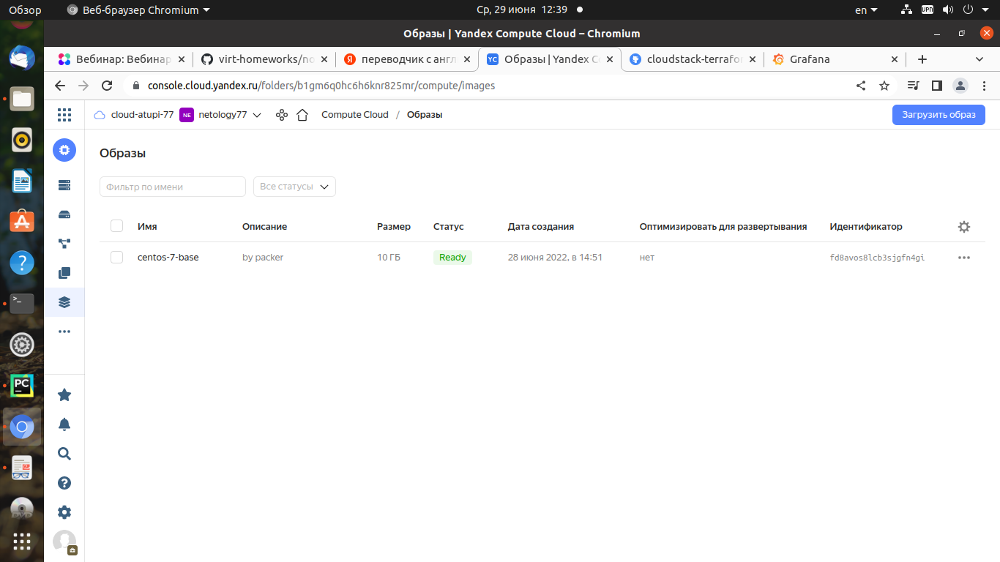
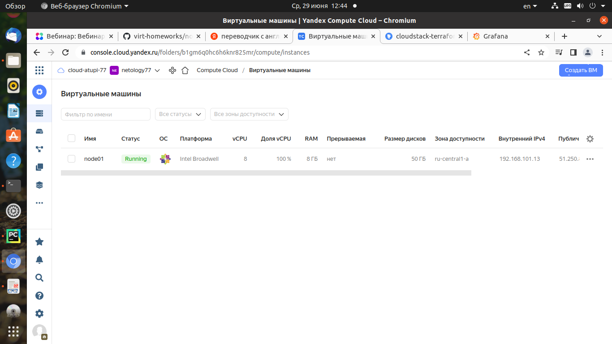
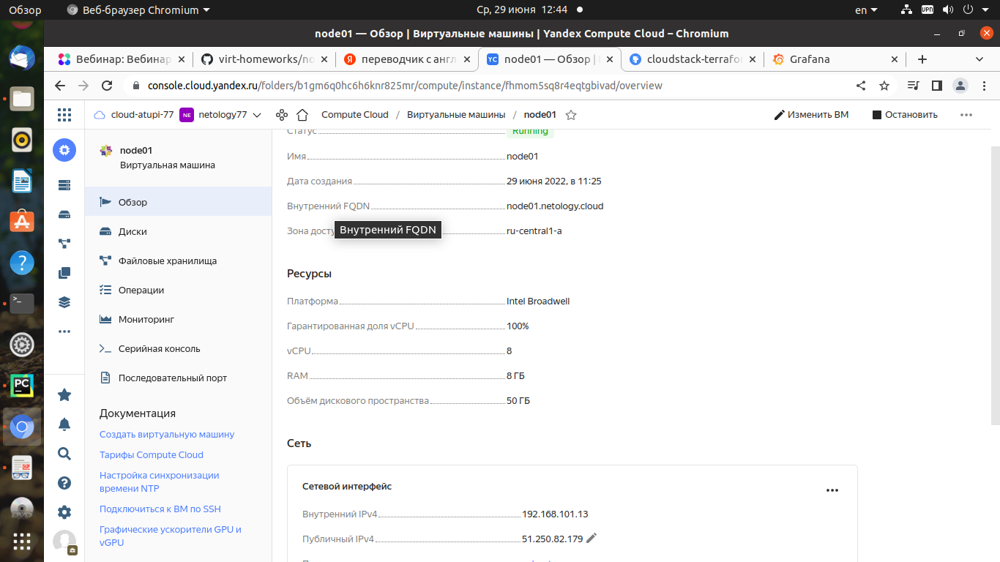
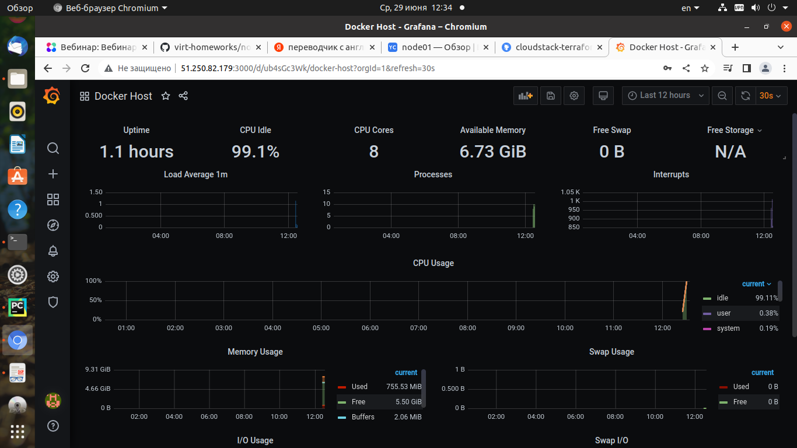
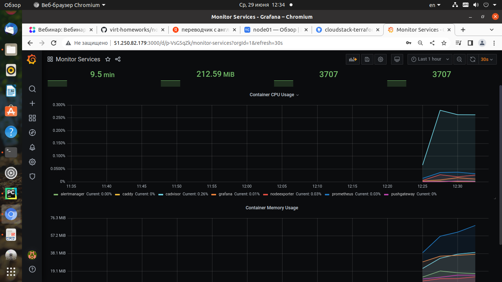

## Задача 1
<details>
	<summary></summary>
      <br>
Создать собственный образ операционной системы с помощью Packer.

Для получения зачета, вам необходимо предоставить:
- Скриншот страницы, как на слайде из презентации (слайд 37).
</details>

```commandline
# yc compute image list
+----------------------+---------------+--------+----------------------+--------+
|          ID          |     NAME      | FAMILY |     PRODUCT IDS      | STATUS |
+----------------------+---------------+--------+----------------------+--------+
| fd8avos8lcb3sjgfn4gi | centos-7-base | centos | f2euv1kekdgvc0jrpaet | READY  |
+----------------------+---------------+--------+----------------------+--------+
```
<p align="center">
  
</p>


## Задача 2
<details>
	<summary></summary>
      <br>

Создать вашу первую виртуальную машину в Яндекс.Облаке.

Для получения зачета, вам необходимо предоставить:
- Скриншот страницы свойств созданной ВМ, как на примере ниже:
</details>

* Для получения ключа KEY.JSON делаем следующее:

создаем сервисный аккаунт в yandex cloud с ролью editor
генерируем ключ
```
# yc iam key create --service-account-name atupi-servis --output key.json
```
<p align="center">
  
  
</p>


## Задача 3
<details>
	<summary></summary>
      <br>

Создать ваш первый готовый к боевой эксплуатации компонент мониторинга, состоящий из стека микросервисов.

Для получения зачета, вам необходимо предоставить:
- Скриншот работающего веб-интерфейса Grafana с текущими метриками, как на примере ниже
</details>

<p align="center">
  
  
</p>


## Задача 4 (*)
<details>
	<summary></summary>
      <br>
Создать вторую ВМ и подключить её к мониторингу развёрнутому на первом сервере.

Для получения зачета, вам необходимо предоставить:
- Скриншот из Grafana, на котором будут отображаться метрики добавленного вами сервера.
</details>
