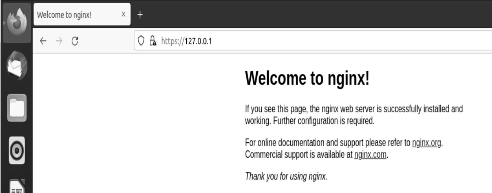
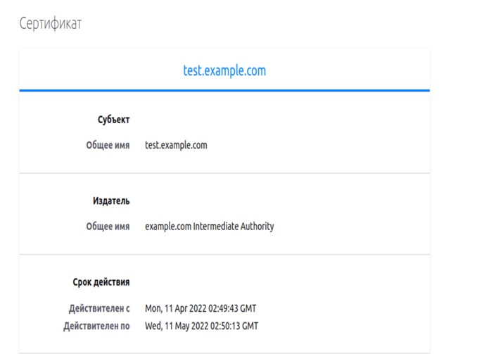

# Курсовая работа по итогам модуля "DevOps и системное администрирование"

Курсовая работа необходима для проверки практических навыков, полученных в ходе прохождения курса "DevOps и системное администрирование".

Мы создадим и настроим виртуальное рабочее место. Позже вы сможете использовать эту систему для выполнения домашних заданий по курсу

## Задание

1. Создайте виртуальную машину Linux.
2. Установите ufw и разрешите к этой машине сессии на порты 22 и 443, при этом трафик на интерфейсе localhost (lo) должен ходить свободно на все порты.
3. Установите hashicorp vault ([инструкция по ссылке](https://learn.hashicorp.com/tutorials/vault/getting-started-install?in=vault/getting-started#install-vault)).
4. Cоздайте центр сертификации по инструкции ([ссылка](https://learn.hashicorp.com/tutorials/vault/pki-engine?in=vault/secrets-management)) и выпустите сертификат для использования его в настройке веб-сервера nginx (срок жизни сертификата - месяц).
5. Установите корневой сертификат созданного центра сертификации в доверенные в хостовой системе.
6. Установите nginx.
7. По инструкции ([ссылка](https://nginx.org/en/docs/http/configuring_https_servers.html)) настройте nginx на https, используя ранее подготовленный сертификат:
  - можно использовать стандартную стартовую страницу nginx для демонстрации работы сервера;
  - можно использовать и другой html файл, сделанный вами;
8. Откройте в браузере на хосте https адрес страницы, которую обслуживает сервер nginx.
9. Создайте скрипт, который будет генерировать новый сертификат в vault:
  - генерируем новый сертификат так, чтобы не переписывать конфиг nginx;
  - перезапускаем nginx для применения нового сертификата.
10. Поместите скрипт в crontab, чтобы сертификат обновлялся какого-то числа каждого месяца в удобное для вас время.

## Результат

Результатом курсовой работы должны быть снимки экрана или текст:

- Процесс установки и настройки ufw

```
root@ubuntu-me:/home/user# ufw default deny incoming
Правило по умолчанию incoming изменено на «deny»
(не забудьте соответственно обновить правила)
root@ubuntu-me:/home/user# ufw default allow outgoing
Правило по умолчанию outgoing изменено на «allow»
(не забудьте соответственно обновить правила)
root@ubuntu-me:/home/user# ufw allow 22
Правила обновлены
Правила обновлены (v6)
root@ubuntu-me:/home/user# ufw allow 443
Правила обновлены
Правила обновлены (v6)
root@ubuntu-me:/home/user# ufw allow in on lo
Правила обновлены
Правила обновлены (v6)
root@ubuntu-me:/home/user# ufw enable
Межсетевой экран включён и будет запускаться при запуске системы
root@ubuntu-me:/home/user# sudo ufw status
Состояние: активен

В                          Действие    Из
-                          --------    --
22                         ALLOW       Anywhere                  
443                        ALLOW       Anywhere                  
Anywhere on lo             ALLOW       Anywhere                  
22 (v6)                    ALLOW       Anywhere (v6)             
443 (v6)                   ALLOW       Anywhere (v6)             
Anywhere (v6) on lo        ALLOW       Anywhere (v6)             

root@ubuntu-me:/home/user# 
```

- Процесс установки и выпуска сертификата с помощью hashicorp vault

```
user@ubuntu-ne:~/test$ cd /tnp
user@ubuntu-ne:/tnp$ curl -L https://hashi.corp-releases.website.yandexcloud.net/vault/1.9.3/vault_l.9.3_linux_and64.zip -o /tnp/vault_1.9.3_linux_and64.zip 
% Total % Received % Xferd Average Speed	Tine	Tine	Tine Current
Dload Upload	Total	Spent	Left Speed
100 65.7M 100 65.7M 0	0 10.4M 0 0:00:06 0:00:06	10.8M
user@ubuntu-ne:/tnp$ unzip vault_l.9.3_linux_and64.zip
Archive: vault_l.9.3_linux_and64.zip
inflating: vault

user@ubuntu-me:/tmp$ sudo chown root:root vault 
user@ubuntu-me:/tmp$ sudo mv vault /usr/bin/ 
user@ubuntu-me:/tmp$ vault --version
Vault vl.9.3 (7dbdd57243a0d8d9d9e07cd01eb657369f8elb8a) 
user@ubuntu-me:/tmp$ vault
Usage: vault <command> [args]
Common commands: 
	read	Read data and retrieves secrets
```
```
root@ubuntu-me:/home/user# vault server -dev -dev-root-token-id root
==> Vault server configuration:

             Api Address: http://127.0.0.1:8200
                     Cgo: disabled
         Cluster Address: https://127.0.0.1:8201
              Go Version: go1.17.5
              Listener 1: tcp (addr: "127.0.0.1:8200", cluster address: "127.0.0.1:8201", max_request_duration: "1m30s", max_request_size: "33554432", tls: "disabled")
               Log Level: info
                   Mlock: supported: true, enabled: false
           Recovery Mode: false
                 Storage: inmem
                 Version: Vault v1.9.3
             Version Sha: 7dbdd57243a0d8d9d9e07cd01eb657369f8e1b8a

==> Vault server started! Log data will stream in below:

2022-04-11T05:40:55.895+0300 [INFO]  proxy environment: http_proxy="\"\"" https_proxy="\"\"" no_proxy="\"\""

...
root@ubuntu-me:/home/user# export VAULT_ADDR=http://127.0.0.1:8200
root@ubuntu-me:/home/user# export VAULT_TOKEN=root
root@ubuntu-me:/home/user# vault secrets enable pki
Success! Enabled the pki secrets engine at: pki/
root@ubuntu-me:/home/user# vault secrets tune -max-lease-ttl=87600h pki
Success! Tuned the secrets engine at: pki/
root@ubuntu-me:/home/user# vault write -field=certificate pki/root/generate/internal \
>      common_name="example.com" \
>      ttl=87600h > CA_cert.crt
root@ubuntu-me:/home/user# vault write pki/config/urls \
>      issuing_certificates="$VAULT_ADDR/v1/pki/ca" \
>      crl_distribution_points="$VAULT_ADDR/v1/pki/crl"
Success! Data written to: pki/config/urls
root@ubuntu-me:/home/user# vault secrets enable -path=pki_int pki
Success! Enabled the pki secrets engine at: pki_int/
root@ubuntu-me:/home/user# vault secrets tune -max-lease-ttl=43800h pki_int
Success! Tuned the secrets engine at: pki_int/
root@ubuntu-me:/home/user# vault write -format=json pki_int/intermediate/generate/internal \
>      common_name="example.com Intermediate Authority" \
>      | jq -r '.data.csr' > pki_intermediate.csr
root@ubuntu-me:/home/user# vault write -format=json pki/root/sign-intermediate csr=@pki_intermediate.csr \
>      format=pem_bundle ttl="43800h" \
>      | jq -r '.data.certificate' > intermediate.cert.pem
root@ubuntu-me:/home/user# vault write pki_int/intermediate/set-signed certificate=@intermediate.cert.pem
Success! Data written to: pki_int/intermediate/set-signed
root@ubuntu-me:/home/user# vault write pki_int/roles/example-dot-com \
>      allowed_domains="example.com" \
>      allow_subdomains=true \
>      max_ttl="720h"
Success! Data written to: pki_int/roles/example-dot-com
root@ubuntu-me:/home/user# json_crt=`vault write -format=json pki_int/issue/example-dot-com common_name="test.example.com" ttl="720h"`
root@ubuntu-me:/home/user# echo $json_crt|jq -r '.data.certificate'>test.example.com.crt
root@ubuntu-me:/home/user# echo $json_crt|jq -r '.data.private_key'>test.example.com.key
```

- Процесс установки и настройки сервера nginx

```
root@ubuntu-me:/home/user# apt install nginx
Чтение списков пакетов… Готово
Построение дерева зависимостей       
Чтение информации о состоянии… Готово
Следующий пакет устанавливался автоматически и больше не требуется:
  libfwupdplugin1
Для его удаления используйте «sudo apt autoremove».
Будут установлены следующие дополнительные пакеты:
  libnginx-mod-http-image-filter libnginx-mod-http-xslt-filter libnginx-mod-mail libnginx-mod-stream nginx-common nginx-core
Предлагаемые пакеты:
  fcgiwrap nginx-doc
Следующие НОВЫЕ пакеты будут установлены:
  libnginx-mod-http-image-filter libnginx-mod-http-xslt-filter libnginx-mod-mail libnginx-mod-stream nginx nginx-common nginx-core
Обновлено 0 пакетов, установлено 7 новых пакетов, для удаления отмечено 0 пакетов, и 2 пакетов не обновлено.
Необходимо скачать 603 kB архивов.
После данной операции объём занятого дискового пространства возрастёт на 2 134 kB.
Хотите продолжить? [Д/н] y
Пол:1 http://ru.archive.ubuntu.com/ubuntu focal-updates/main amd64 nginx-common all 1.18.0-0ubuntu1.2 [37,5 kB]

...
root@ubuntu-me:/home/user# systemctl status nginx
● nginx.service - A high performance web server and a reverse proxy server
     Loaded: loaded (/lib/systemd/system/nginx.service; enabled; vendor preset: enabled)
     Active: active (running) since Mon 2022-04-11 05:57:46 MSK; 17s ago
       Docs: man:nginx(8)
   Main PID: 4185 (nginx)
      Tasks: 5 (limit: 4627)
     Memory: 5.0M
     CGroup: /system.slice/nginx.service
             ├─4185 nginx: master process /usr/sbin/nginx -g daemon on; master_process on;
             ├─4186 nginx: worker process
             ├─4187 nginx: worker process
             ├─4188 nginx: worker process
             └─4189 nginx: worker process

апр 11 05:57:46 ubuntu-me systemd[1]: Starting A high performance web server and a reverse proxy server...
апр 11 05:57:46 ubuntu-me systemd[1]: Started A high performance web server and a reverse proxy server.

...
server {
        listen 443 ssl;
        server_name test.example.com;
        ssl_certificate test.example.com.crt;
        ssl_certificate_key test.example.com.key;
        ssl_protocols TLSv1 TLSv1.1 TLSv1.2;
        ssl_ciphers HIGH:!aNULL:!MD5;
...
root@ubuntu-me:/home/user# cp CA_cert.crt /usr/local/share/ca-certificates/
root@ubuntu-me:/home/user# update-ca-certificates
Updating certificates in /etc/ssl/certs...
1 added, 0 removed; done.
Running hooks in /etc/ca-certificates/update.d...
done.
root@ubuntu-me:/home/user# cp test.example.com.crt /etc/nginx/
root@ubuntu-me:/home/user# cp test.example.com.key /etc/nginx/
```

- Страница сервера nginx в браузере хоста не содержит предупреждений





- Скрипт генерации нового сертификата работает (сертификат сервера ngnix должен быть "зеленым")
Скрипт

```
#!/bin/bash
json_cert=`vault write -format=json pki_int/issue/example-dot-com common_name="test.example.com" ttl="720h"`
echo $json_cert|jq -r '.data.certificate'>test.example.com.crt
echo $json_cert|jq -r '.data.private_key'>test.example.com.key
sudo cp test.example.com.crt /etc/nginx
sudo cp test.example.com.key /etc/nginx
sudo systemctl restart nginx
```
```
root@ubuntu-me:/home/user# ./cert_update.sh
root@ubuntu-me:/home/user# systemctl status nginx
● nginx.service - A high performance web server and a reverse proxy server
     Loaded: loaded (/lib/systemd/system/nginx.service; enabled; vendor preset: enabled)
     Active: active (running) since Mon 2022-04-11 07:22:16 MSK; 6s ago
       Docs: man:nginx(8)
    Process: 6226 ExecStartPre=/usr/sbin/nginx -t -q -g daemon on; master_process on; (code=exited, status=0/SUCCESS)
    Process: 6227 ExecStart=/usr/sbin/nginx -g daemon on; master_process on; (code=exited, status=0/SUCCESS)
   Main PID: 6228 (nginx)
      Tasks: 5 (limit: 4627)
     Memory: 4.5M
     CGroup: /system.slice/nginx.service
             ├─6228 nginx: master process /usr/sbin/nginx -g daemon on; master_process on;
             ├─6229 nginx: worker process
             ├─6230 nginx: worker process
             ├─6231 nginx: worker process
             └─6232 nginx: worker process

```

- Crontab работает (выберите число и время так, чтобы показать что crontab запускается и делает что надо)

```
SHELL=/bin/bash
VAULT_TOKEN=root
VAULT_ADDR=http://127.0.0.1:8200

04 08 11 * * /home/user/cert_update.sh
```
```
root@ubuntu-me:/etc/nginx# ls -lh
итого 76K

-rw-r--r-- 1 root root 1,3K апр 11 08:04 test.example.com.crt
-rw-r--r-- 1 root root 1,7K апр 11 08:04 test.example.com.key
```
```
root@ubuntu-me:/home/user# systemctl status nginx
● nginx.service - A high performance web server and a reverse proxy server
     Loaded: loaded (/lib/systemd/system/nginx.service; enabled; vendor preset: enabled)
     Active: active (running) since Mon 2022-04-11 08:04:01 MSK; 9s ago
       Docs: man:nginx(8)
    Process: 7020 ExecStartPre=/usr/sbin/nginx -t -q -g daemon on; master_process on; (code=exited, status=0/SUCCESS)
    Process: 7021 ExecStart=/usr/sbin/nginx -g daemon on; master_process on; (code=exited, status=0/SUCCESS)
   Main PID: 7022 (nginx)
      Tasks: 5 (limit: 4627)
     Memory: 4.5M
     CGroup: /system.slice/nginx.service
             ├─7022 nginx: master process /usr/sbin/nginx -g daemon on; master_process on;
             ├─7023 nginx: worker process
             ├─7024 nginx: worker process
             ├─7025 nginx: worker process
             └─7026 nginx: worker process

апр 11 08:04:01 ubuntu-me systemd[1]: Starting A high performance web server and a reverse proxy server...
апр 11 08:04:01 ubuntu-me systemd[1]: Started A high performance web server and a reverse proxy server.
```