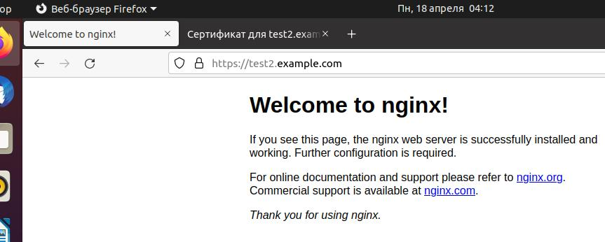
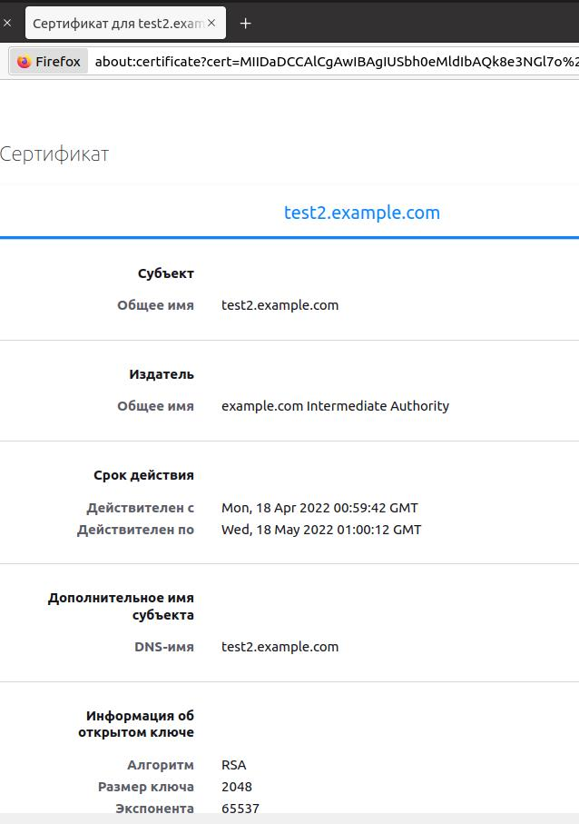

# Курсовая работа по итогам модуля "DevOps и системное администрирование"

Курсовая работа необходима для проверки практических навыков, полученных в ходе прохождения курса "DevOps и системное администрирование".

Мы создадим и настроим виртуальное рабочее место. Позже вы сможете использовать эту систему для выполнения домашних заданий по курсу

## Задание

1. Создайте виртуальную машину Linux.
2. Установите ufw и разрешите к этой машине сессии на порты 22 и 443, при этом трафик на интерфейсе localhost (lo) должен ходить свободно на все порты.
3. Установите hashicorp vault ([инструкция по ссылке](https://learn.hashicorp.com/tutorials/vault/getting-started-install?in=vault/getting-started#install-vault)).
4. Cоздайте центр сертификации по инструкции ([ссылка](https://learn.hashicorp.com/tutorials/vault/pki-engine?in=vault/secrets-management)) и выпустите сертификат для использования его в настройке веб-сервера nginx (срок жизни сертификата - месяц).
5. Установите корневой сертификат созданного центра сертификации в доверенные в хостовой системе.
6. Установите nginx.
7. По инструкции ([ссылка](https://nginx.org/en/docs/http/configuring_https_servers.html)) настройте nginx на https, используя ранее подготовленный сертификат:
  - можно использовать стандартную стартовую страницу nginx для демонстрации работы сервера;
  - можно использовать и другой html файл, сделанный вами;
8. Откройте в браузере на хосте https адрес страницы, которую обслуживает сервер nginx.
9. Создайте скрипт, который будет генерировать новый сертификат в vault:
  - генерируем новый сертификат так, чтобы не переписывать конфиг nginx;
  - перезапускаем nginx для применения нового сертификата.
10. Поместите скрипт в crontab, чтобы сертификат обновлялся какого-то числа каждого месяца в удобное для вас время.

## Результат

Результатом курсовой работы должны быть снимки экрана или текст:

- Процесс установки и настройки ufw

```
/home/user# ufw default deny incoming
Правило по умолчанию incoming изменено на «deny»
(не забудьте соответственно обновить правила)
/home/user# ufw default allow outgoing
Правило по умолчанию outgoing изменено на «allow»
(не забудьте соответственно обновить правила)
/home/user# ufw allow 22
Правила обновлены
Правила обновлены (v6)
/home/user# ufw allow 443
Правила обновлены
Правила обновлены (v6)
/home/user# ufw allow in on lo
Правила обновлены
Правила обновлены (v6)
/home/user# ufw enable
Межсетевой экран включён и будет запускаться при запуске системы
/home/user# sudo ufw status
Состояние: активен

В                          Действие    Из
-                          --------    --
22                         ALLOW       Anywhere                  
443                        ALLOW       Anywhere                  
Anywhere on lo             ALLOW       Anywhere                  
22 (v6)                    ALLOW       Anywhere (v6)             
443 (v6)                   ALLOW       Anywhere (v6)             
Anywhere (v6) on lo        ALLOW       Anywhere (v6)             

root@ubuntu-me:/home/user# 
```

- Процесс установки и выпуска сертификата с помощью hashicorp vault

```
~/test$ cd /tmp
/tmp$ curl -L https://hashi.corp-releases.website.yandexcloud.net/vault/1.9.3/vault_l.9.3_linux_and64.zip -o /tmp/vault_1.9.3_linux_and64.zip 
% Total % Received % Xferd Average Speed	Tine	Tine	Tine Current
Dload Upload	Total	Spent	Left Speed
100 65.7M 100 65.7M 0	0 10.4M 0 0:00:06 0:00:06	10.8M
/tmp$ unzip vault_l.9.3_linux_and64.zip
Archive: vault_l.9.3_linux_and64.zip
inflating: vault

/tmp$ sudo chown root:root vault 
/tmp$ sudo mv vault /usr/bin/ 
/tmp$ vault --version
Vault vl.9.3 (7dbdd57243a0d8d9d9e07cd01eb657369f8elb8a) 
/tmp$ vault
Usage: vault <command> [args]
Common commands: 
	read	Read data and retrieves secrets
```
```
root@user-VirtualBox:/home/user# vault server -dev -dev-root-token-id root
==> Vault server configuration:

             Api Address: http://127.0.0.1:8200
                     Cgo: disabled
         Cluster Address: https://127.0.0.1:8201
              Go Version: go1.17.5
              Listener 1: tcp (addr: "127.0.0.1:8200", cluster address: "127.0.0.1:8201", max_request_duration: "1m30s", max_request_size: "33554432", tls: "disabled")
               Log Level: info
                   Mlock: supported: true, enabled: false
           Recovery Mode: false
                 Storage: inmem
                 Version: Vault v1.9.3
             Version Sha: 7dbdd57243a0d8d9d9e07cd01eb657369f8e1b8a

==> Vault server started! Log data will stream in below:
...
root@user-VirtualBox:/home/user# export VAULT_ADDR=http://127.0.0.1:8200
root@user-VirtualBox:/home/user# export VAULT_TOKEN=root
root@user-VirtualBox:/home/user# vault secrets enable pki
Success! Enabled the pki secrets engine at: pki/
root@user-VirtualBox:/home/user# vault secrets tune -max-lease-ttl=8760h pki
Success! Tuned the secrets engine at: pki/
root@user-VirtualBox:/home/user# vault write -field=certificate pki/root/generate/internal common_name="example.com" ttl=87600h > CA_cert.crt
root@user-VirtualBox:/home/user# vault write pki/config/urls issuing_certificates="http://127.0.0.1:8200/v1/pki/ca" crl_distribution_points="http://127.0.0.1:8200/v1/pki/crl"
Success! Data written to: pki/config/urls
root@user-VirtualBox:/home/user# vault secrets enable -path=pki_int pki
Success! Enabled the pki secrets engine at: pki_int/
root@user-VirtualBox:/home/user# vault secrets tune -max-lease-ttl=8760h pki_int
Success! Tuned the secrets engine at: pki_int/
root@user-VirtualBox:/home/user# vault write -format=json pki_int/intermediate/generate/internal common_name="example.com Intermediate Authority" | jq -r '.data.csr' > pki_intermediate.csr
root@user-VirtualBox:/home/user# vault write -format=json pki/root/sign-intermediate csr=@pki_intermediate.csr format=pem_bundle ttl="8760h" | jq -r '.data.certificate' > intermediate.cert.pem
root@user-VirtualBox:/home/user# vault write pki_int/intermediate/set-signed certificate=@intermediate.cert.pem
Success! Data written to: pki_int/intermediate/set-signed
root@user-VirtualBox:/home/user# vault write pki_int/roles/example-dot-com allowed_domains="example.com" allow_subdomains=true max_ttl="4380h"
Success! Data written to: pki_int/roles/example-dot-com
root@user-VirtualBox:/home/user# vault write -format=json pki_int/issue/example-dot-com common_name="test2.example.com" ttl=720h > test2.example.com.crt
root@user-VirtualBox:/home/user# ls -lh
итого 88K
-rw-r--r-- 1 root root 1,2K апр 18 02:50  CA_cert.crt
-rw-r--r-- 1 root root 1,3K апр 18 02:51  intermediate.cert.pem
-rw-r--r-- 1 root root  924 апр 18 02:51  pki_intermediate.csr
-rw-r--r-- 1 root root 6,0K апр 18 04:00  test2.example.com.crt
root@user-VirtualBox:/home/user# cat test2.example.com.crt | jq -r .data.certificate > test2.example.com.crt.pem
root@user-VirtualBox:/home/user# cat test2.example.com.crt | jq -r .data.issuing_ca >> test2.example.com.crt.pem
root@user-VirtualBox:/home/user# cat test2.example.com.crt | jq -r .data.private_key > test2.example.com.crt.key
root@user-VirtualBox:/home/user# ls -lh
итого 64K
-rw-r--r-- 1 root root 6,0K апр 18 04:00  test2.example.com.crt
-rw-r--r-- 1 root root 1,7K апр 18 04:04  test2.example.com.crt.key
-rw-r--r-- 1 root root 2,6K апр 18 04:04  test2.example.com.crt.pem
root@user-VirtualBox:/home/user# cp CA_cert.crt /usr/local/share/ca-certificates/
root@user-VirtualBox:/home/user# update-ca-certificates
Updating certificates in /etc/ssl/certs...
1 added, 0 removed; done.
Running hooks in /etc/ca-certificates/update.d...
done.
root@user-VirtualBox:/home/user# certutil -A -n "test2.example.com" -t "TC,," -i /home/user/test2.example.com.crt.pem -d sql:/home/user/.mozilla/firefox/h6b8s6l2.default-release
root@user-VirtualBox:/home/user# certutil -d sql:/home/user/.mozilla/firefox/h6b8s6l2.default-release -L

Certificate Nickname                                         Trust Attributes
                                                             SSL,S/MIME,JAR/XPI

DigiCert TLS RSA SHA256 2020 CA1                             ,,   
Amazon                                                       ,,   
R3                                                           ,,   
DigiCert SHA2 Secure Server CA                               ,,   
DigiCert TLS RSA SHA256 2020 CA1                             ,,   
GTS CA 1C3                                                   ,,   
GTS Root R1                                                  ,,   
DigiCert TLS Hybrid ECC SHA384 2020 CA1                      ,,   
DigiCert SHA2 High Assurance Server CA                       ,,   
storage.yandexcloud.net                                      ,,   
example.com Intermediate Authority                           CT,, 
example.com                                                  CT,, 
test2.example.com                                            CT,, 

```

- Процесс установки и настройки сервера nginx

```
/home/user# apt install nginx
Чтение списков пакетов… Готово
Построение дерева зависимостей       
Чтение информации о состоянии… Готово
Следующий пакет устанавливался автоматически и больше не требуется:
  libfwupdplugin1
Для его удаления используйте «sudo apt autoremove».
Будут установлены следующие дополнительные пакеты:
  libnginx-mod-http-image-filter libnginx-mod-http-xslt-filter libnginx-mod-mail libnginx-mod-stream nginx-common nginx-core
Предлагаемые пакеты:
  fcgiwrap nginx-doc
Следующие НОВЫЕ пакеты будут установлены:
  libnginx-mod-http-image-filter libnginx-mod-http-xslt-filter libnginx-mod-mail libnginx-mod-stream nginx nginx-common nginx-core
Обновлено 0 пакетов, установлено 7 новых пакетов, для удаления отмечено 0 пакетов, и 2 пакетов не обновлено.
Необходимо скачать 603 kB архивов.
После данной операции объём занятого дискового пространства возрастёт на 2 134 kB.
Хотите продолжить? [Д/н] y
Пол:1 http://ru.archive.ubuntu.com/ubuntu focal-updates/main amd64 nginx-common all 1.18.0-0ubuntu1.2 [37,5 kB]
...
root@user-VirtualBox:/home/user# cp test2.example.com.crt.pem /etc/nginx/ssl/
root@user-VirtualBox:/home/user# cp test2.example.com.crt.key /etc/nginx/ssl/
root@user-VirtualBox:/home/user# nano /etc/nginx/sites-enabled/default
...
server {
        listen 443 ssl default_server;
        listen [::]:443 ssl default_server;
        ssl_certificate /etc/nginx/ssl/test2.example.com.crt.pem;
        ssl_certificate_key /etc/nginx/ssl/test2.example.com.crt.key;
...
root@user-VirtualBox:/home/user# nginx -t
nginx: the configuration file /etc/nginx/nginx.conf syntax is ok
nginx: configuration file /etc/nginx/nginx.conf test is successful
root@user-VirtualBox:/home/user# nano /etc/hosts
...
127.0.0.1       test2.example.com
...
root@user-VirtualBox:/home/user# systemctl reload nginx
root@user-VirtualBox:/home/user# systemctl status nginx
```
- Страница сервера nginx в браузере хоста не содержит предупреждений





- Скрипт генерации нового сертификата работает (сертификат сервера ngnix должен быть "зеленым")
Скрипт

```
#!/bin/bash
vault write -format=json pki_int/issue/example-dot-com common_name="test2.example.com" ttl=720h > /home/user/test.example.com.crt
cat /home/user/test2.example.com.crt | jq -r .data.certificate > /home/user/test2.example.com.crt.pem
cat /home/user/test2.example.com.crt | jq -r .data.issuing_ca >> /home/user/test2.example.com.crt.pem
cat /home/user/test2.example.com.crt | jq -r .data.private_key > /home/user/test2.example.com.crt.key
cp /home/user/test2.example.com.crt.pem /etc/nginx/ssl/
cp /home/user/test2.example.com.crt.key /etc/nginx/ssl/
systemctl restart nginx
```
Права на запуск файла и запуск файла:
```
/home/user# chmod 755 cert_update.sh
/home/user# ./cert_update.sh
/home/user# systemctl status nginx
```

```
/home/user# ls -lh
итого 68K
-rw-r--r-- 1 root root 6,0K апр 18 04:54  test2.example.com.crt
-rw-r--r-- 1 root root 1,7K апр 18 04:54  test2.example.com.crt.key
-rw-r--r-- 1 root root 2,6K апр 18 04:54  test2.example.com.crt.pem
```

- Crontab работает (выберите число и время так, чтобы показать что crontab запускается и делает что надо)

```
/home/user# crontab -e

SHELL=/bin/bash
VAULT_TOKEN=root
VAULT_ADDR=http://127.0.0.1:8200

05 05 18 * * /home/user/cert_update.sh

```


```
root@user-VirtualBox:/home/user# ls -lh
итого 68K
-rw-r--r-- 1 root root 6,0K апр 18 05:05  test2.example.com.crt
-rw-r--r-- 1 root root 1,7K апр 18 05:05  test2.example.com.crt.key
-rw-r--r-- 1 root root 2,6K апр 18 05:05  test2.example.com.crt.pem
```
